# SCALER orchestration diagrams

These diagrams use [Mermaid](https://mermaid.js.org/) fenced blocks, which GitHub renders directly inside Markdown files. They are meant to explain the orchestration model, not replace the command reference in `manual/commands.md`.

## Contents

1. [System boundaries and storage](#1-system-boundaries-and-storage)
2. [Whole autonomous orchestration graph](#2-whole-autonomous-orchestration-graph)
3. [Supervisor stage FSM](#3-supervisor-stage-fsm)
4. [Task status FSM](#4-task-status-fsm)
5. [Autonomous Stage I-IV workflow](#5-autonomous-stage-i-iv-workflow)
6. [Task-agent execution flow](#6-task-agent-execution-flow)
7. [Validation, debug, retry, and replan flow](#7-validation-debug-retry-and-replan-flow)
8. [Context selection, splitting, and handoff](#8-context-selection-splitting-and-handoff)
9. [Parent-session context injection and compaction](#9-parent-session-context-injection-and-compaction)
10. [MCP enumeration and tool invocation flow](#10-mcp-enumeration-and-tool-invocation-flow)
11. [Watchdog, pause, and resume flow](#11-watchdog-pause-and-resume-flow)
12. [SCALER data ledger map](#12-scaler-data-ledger-map)

---

## 1. System boundaries and storage

This diagram shows why some files are local to the project while Pi session files stay in `~/.pi/agent`.

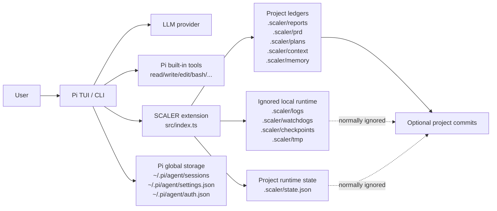

Rule of thumb:

- Pi conversations and auth belong to `~/.pi/agent`.
- SCALER project orchestration belongs to `.scaler/`.
- Local runtime telemetry such as `.scaler/state.json` and `.scaler/watchdogs/` is ignored unless you intentionally archive a run.

---

## 2. Whole autonomous orchestration graph

This is the big picture: one user request starts a supervised autonomous loop, but SCALER keeps state, validation, safety, budgets, and recovery ledgers deterministic.

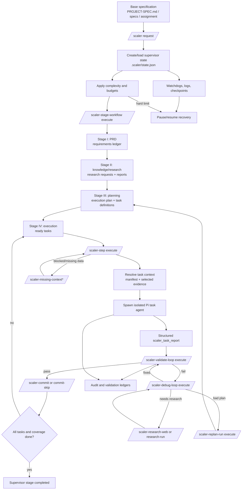

Main automation commands:

```text
/scaler <request>
/scaler-stage-workflow execute max=20 research=3 requests=5 internet
/scaler-step execute
/scaler-validate-loop <taskId> execute max=3
/scaler-commit <taskId>
```

---

## 3. Supervisor stage FSM

This is the top-level finite-state machine from `src/supervisor.ts`.

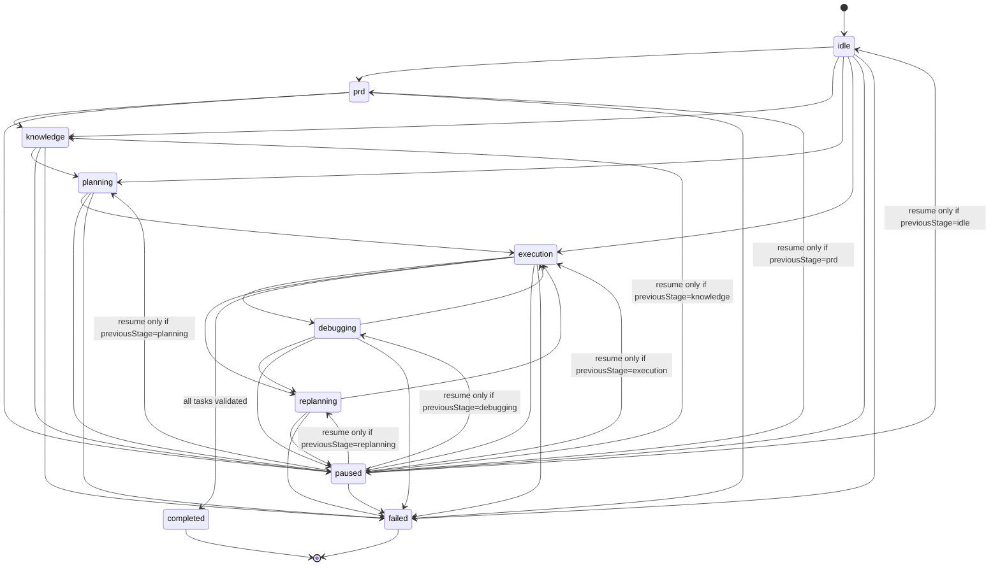

Notes:

- Invalid transitions are not silently applied; they are recorded in `rejectedTransitions`.
- `completed` is guarded: if tasks exist, all tasks must be validated first.
- `paused` remembers `previousStage`; normal resume can only return there.

---

## 4. Task status FSM

This is the per-task finite-state machine from `src/supervisor.ts`.

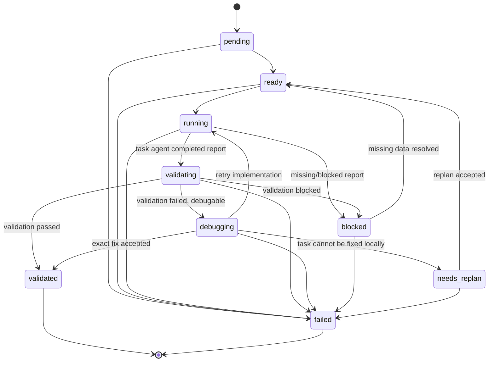

Typical autonomous loop:

```text
pending -> ready -> running -> validating -> validated
```

Typical recovery loop:

```text
validating -> debugging -> running -> validating
```

---

## 5. Autonomous Stage I-IV workflow

`/scaler-stage-workflow` is the highest-level coordinator. It advances ready artifacts when possible and otherwise delegates to focused agents or deterministic merge/apply steps.

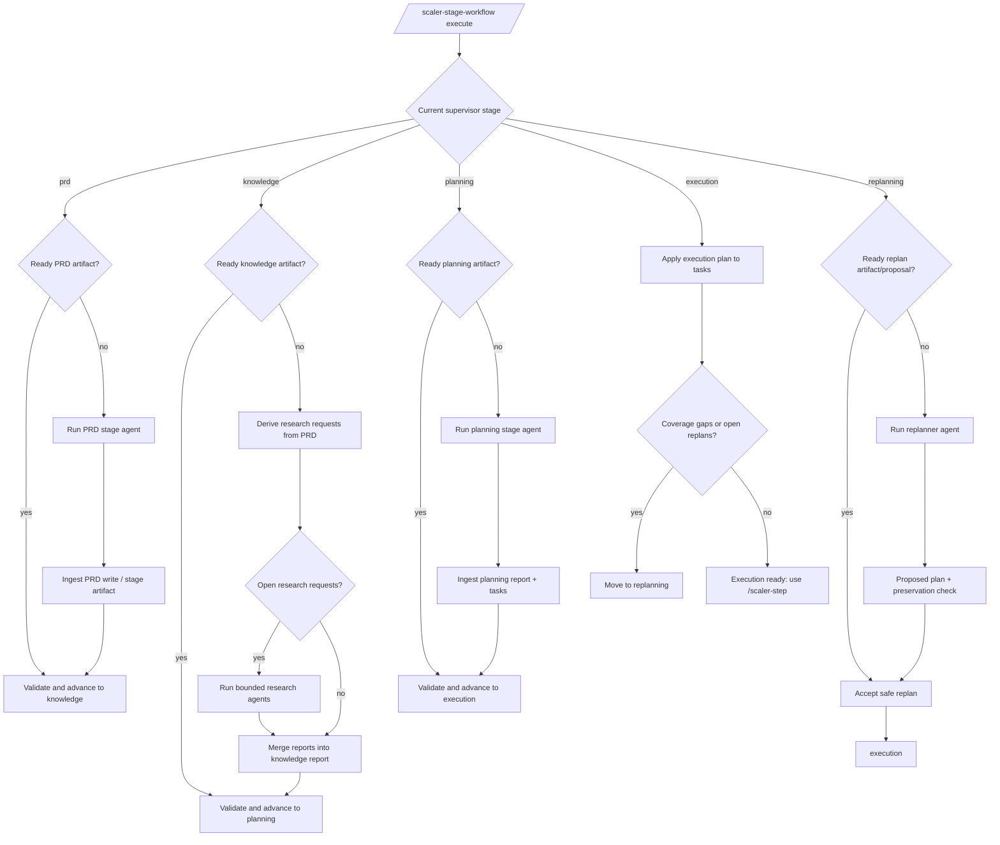

Useful inspection commands:

```text
/scaler-stage-status
/scaler-stage-workflow-runs
/scaler-prd-status
/scaler-plan-status
/scaler-replans
```

---

## 6. Task-agent execution flow

`/scaler-step execute` selects and runs one implementation task under lock, context, budget, safety, and structured-report gates.

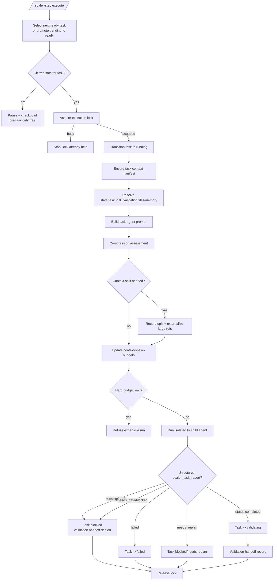

Key idea: a child process exiting successfully is not enough. SCALER requires the structured task report before validation handoff.

---

## 7. Validation, debug, retry, and replan flow

Validation is the acceptance gate. Debugging is focused on exact failed evidence. Replanning is for bad assumptions or work that cannot be repaired locally.

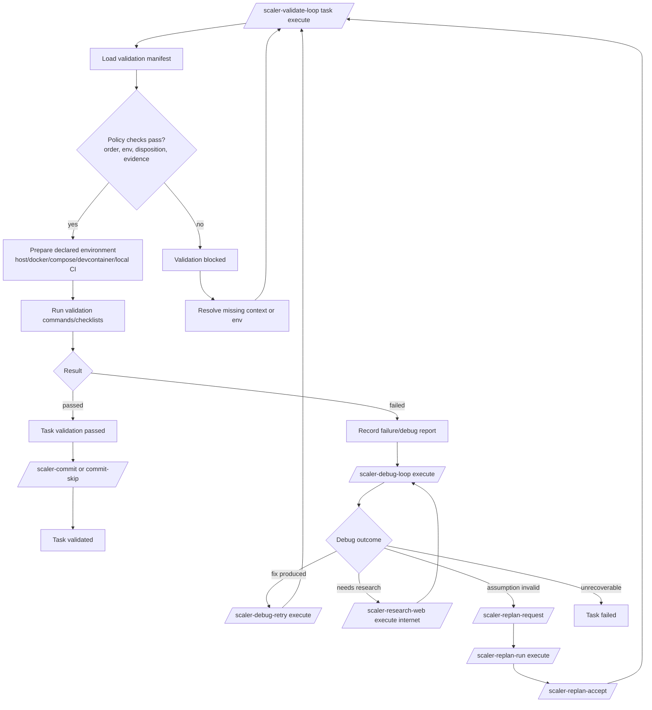

Useful commands:

```text
/scaler-validation-add ...
/scaler-validation-checklist ...
/scaler-validate-loop <taskId> execute max=3
/scaler-debug-loop <taskId> execute max=3
/scaler-debug-retry-policy ...
/scaler-debug-retry-approve ...
```

---

## 8. Context selection, splitting, and handoff

SCALER uses manifests and budgets so child agents receive enough context without flooding the model.

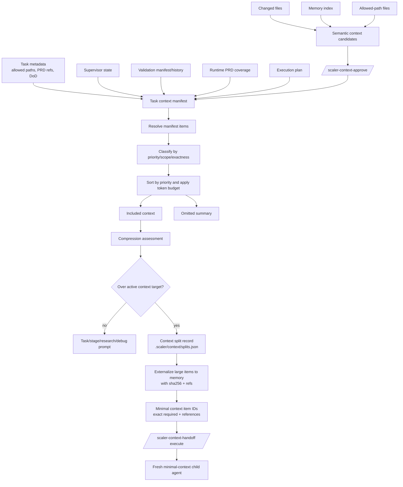

Context item dimensions:

- priority: `required`, `useful`, `optional`;
- scope: `full`, `section`, `snippet`, `summary`, `reference-only`;
- exactness: `exact`, `summary-ok`, `reference-only`.

Commands:

```text
/scaler-context-init <taskId>
/scaler-context-candidates <taskId> <query> limit=5
/scaler-context-approve <taskId> <candidateId> <query>
/scaler-context-status <taskId>
/scaler-context-splits <taskId>
/scaler-context-handoff <splitId> execute
```

---

## 9. Parent-session context injection and compaction

SCALER also participates in the parent Pi session. It injects compact approved context and customizes compaction summaries.

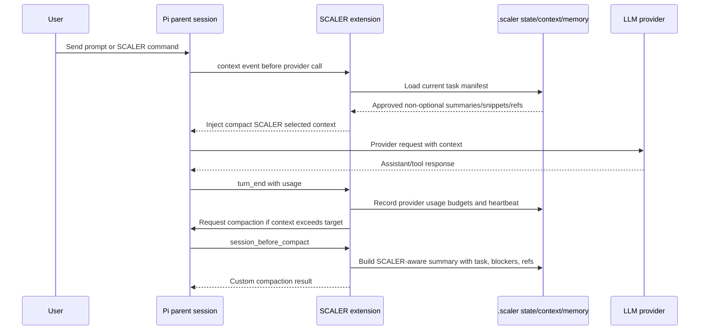

The injected parent-session context intentionally excludes optional/full items unless they were approved and fit the compact budget.

---

## 10. MCP enumeration and tool invocation flow

SCALER does not blindly run MCP servers. It first enumerates declarations and records risk metadata. Tool execution is delegated to bounded tool-agent transactions with structured results.

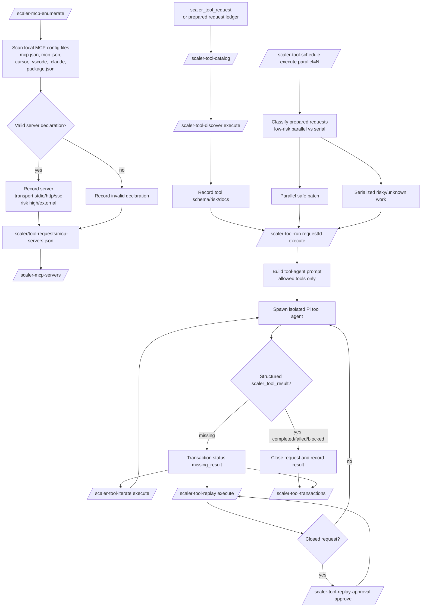

Important safety properties:

- MCP enumeration records declarations; it does not execute servers.
- Tool agents receive only explicitly allowed tools.
- Missing structured results do not count as successful completion.
- Closed-request replay requires explicit replay approval.
- Unknown/risky/destructive/external/secret work should remain serialized or blocked by policy.

---

## 11. Watchdog, pause, and resume flow

Watchdogs are for recovering from stalled work, repeated replanning, and interrupted processes.

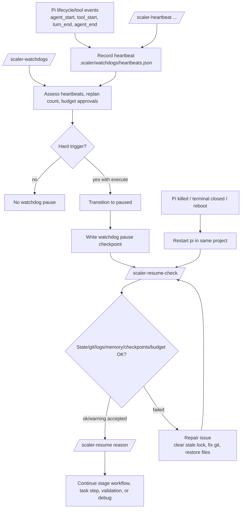

Useful recovery commands:

```text
/scaler-resume-check
/scaler-resume resumed after restart
/scaler-lock
/scaler-lock-clear <reason>
/scaler-watchdogs execute
/scaler-runs
/scaler-task-reports
```

---

## 12. SCALER data ledger map

This shows the main persistent evidence ledgers. Some are project artifacts; some are ignored runtime telemetry.

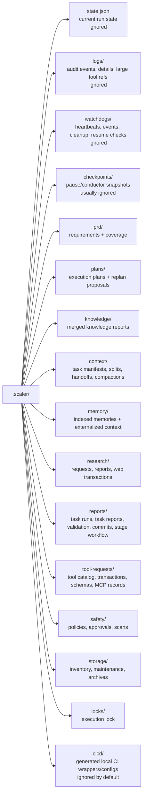

When reviewing a run, start with:

```text
/scaler-status
/scaler-stage-status
/scaler-tasks
/scaler-task-reports
/scaler-budget-status
/scaler-watchdogs
```

When reviewing project evidence, inspect:

```text
.scaler/prd/
.scaler/plans/
.scaler/knowledge/
.scaler/reports/
.scaler/research/
```
